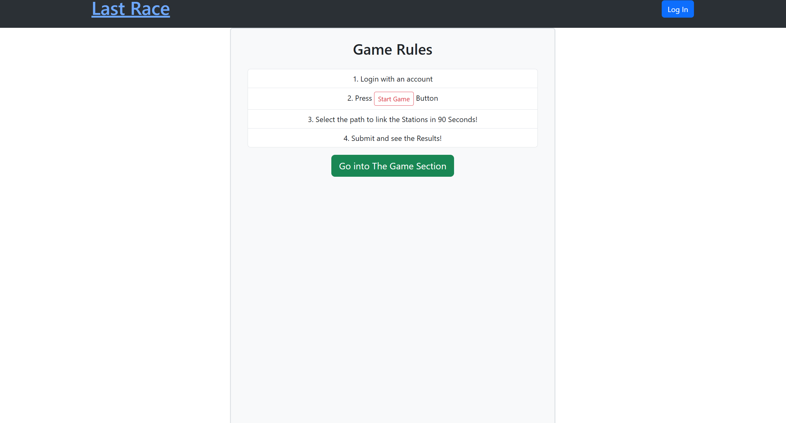
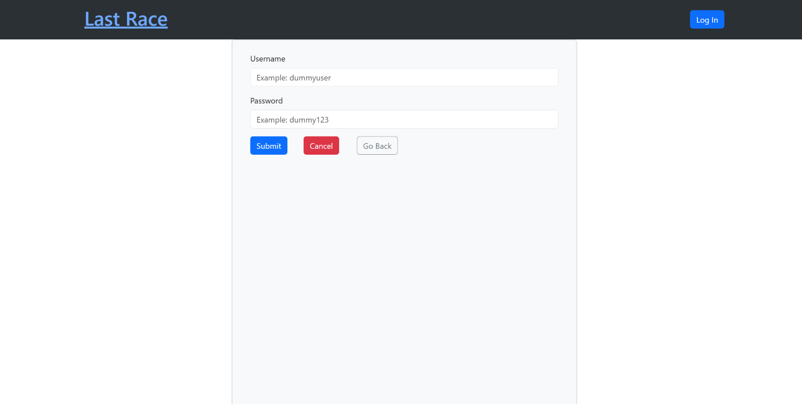
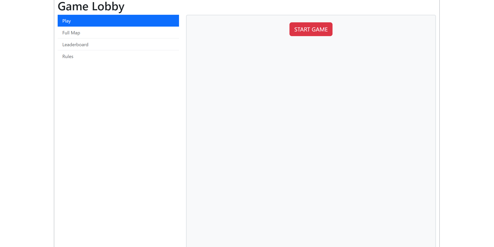
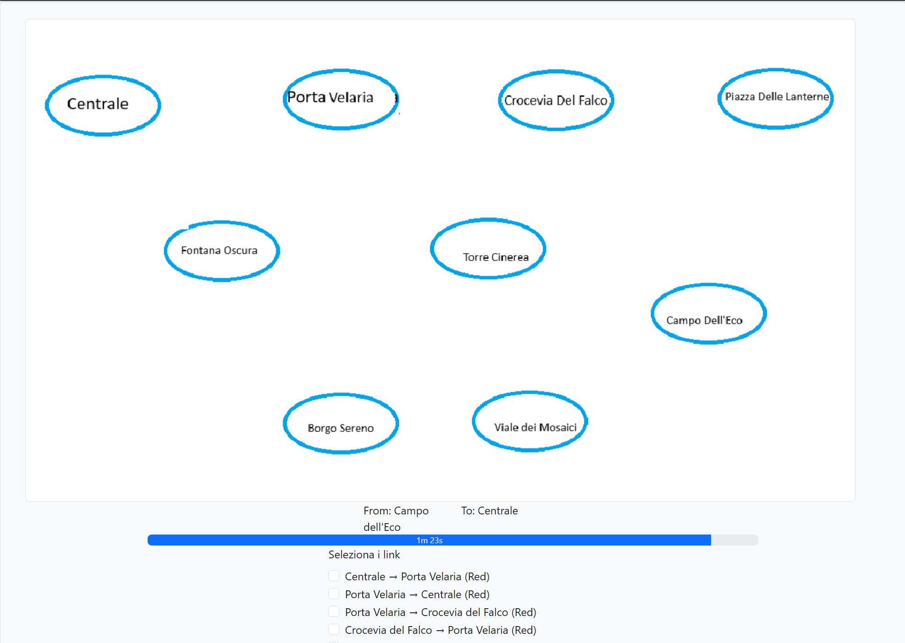
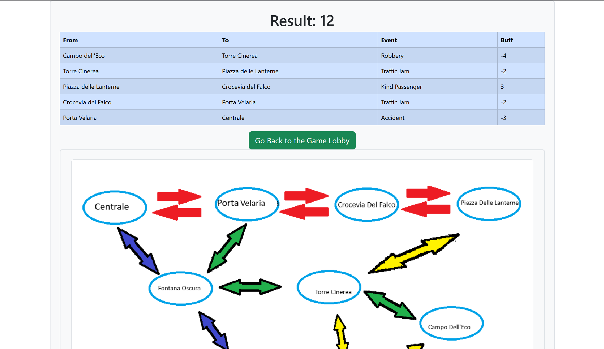

# Exam #N: "Exam Title"
## Student: s364170 DE CATA GIOVANNI

## React Client Application Routes

- Route `/`: HomePage With Rules that can be visited by anyone
- Route `/login`: Login Page
- Route `/GameLobby`: Main Page for registered users, here you can start a Game
- Route `/GameLobby/map`: for registered Users Only, here you can see the Full Map
- route `/GameLobby/leaderboard`: for registered Users Only, here you can see the leaderboard
- route `/GameLobby/rules`: for registered Users Only, here you can see the rules
- route `/Game`: for registered Users Only, here is the page where the player plays
- route `/Game/result`: for registered Users Only, after the game the player sees his score

## API Server

- POST `/api/session`
  - is the api login post method
  - the browser sends through the body username and password
  - the system validates data and if positive authorizes the browser starting a session
- DELETE `/api/session/current/logout`
  - deletes the session data
- GET `/api/Stations`
  - requests a station from the server, if you don't specify what station you want you get all stations
  - response body content: contains the requested station/s
  - needs authentication
- POST `/api/Links`
  - requests a link from the server, if you don't specify parameters you get all links
  - response body content: contains the requested link/s
  - needs authentication
- GET `/api/RandomStations`
  - requests 2 random stations with distance between them of at least 3 links
  - needs to be logged in
- GET `/api/highscores`
  - requests the list of high scores of all players
- GET `/api/GetRandomEvents`
  - retrieves a certain number of events, if not specified it retrieves 1 event
  - header params: number
  - needs to be logged in
  
- POST `/api/Register/Race`
  - sends the score of the race

## Database Tables

- `USERS`:
  -contains USERNAME, PASSWORD, SALT
- STATIONS
  - contains: NAME
- LINKS
  - contains: FROM, TO, COLOR
- EVENTS
  - contains: EID, NAME, BUFF
- RACES: contains: RID, PLAYER, SCORE

## Main React Components

- `HomePage.jsx`: its the home page accessible to all users.
    here you can read the rules
-  `GameLobby.jsx`: the main page visible for registered users, here you navigate through different components, such Map.jsx, Leaderboard.jsx, Rules.jsx,
- `Game.jsx`: game main component,here the player plays the game
- `GameForm.jsx`: game form, here the player builds the path to   be submitted 
- `Result.jsx`: result page, after submission, the data retrieved gets analyzed here, here the web app calculates the result of the path builded by teh player and visualizes it

(only _main_ components, minor ones may be skipped)

## Screenshot

## Users Credentials

| username | password |
| --- | --- |
| dummyuser | dummy123 |
| ciaomario | dummy123 |

## Use of AI Tools
 In this project i used AI Tools basically, for troubleshooting, testing and explanations of how certain code parts would work.
 I also used AI for things not like populating the dbs,
 code revisions ad explanations.
 the most of the code was made by me.

